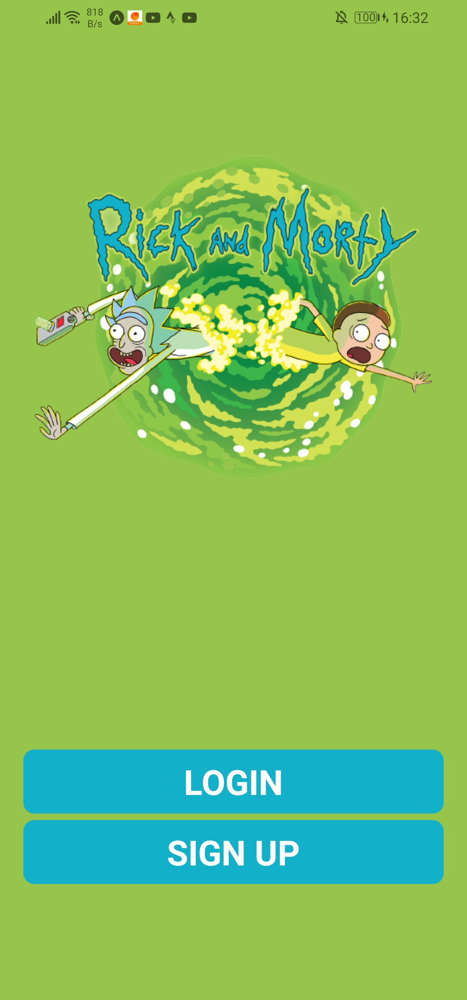
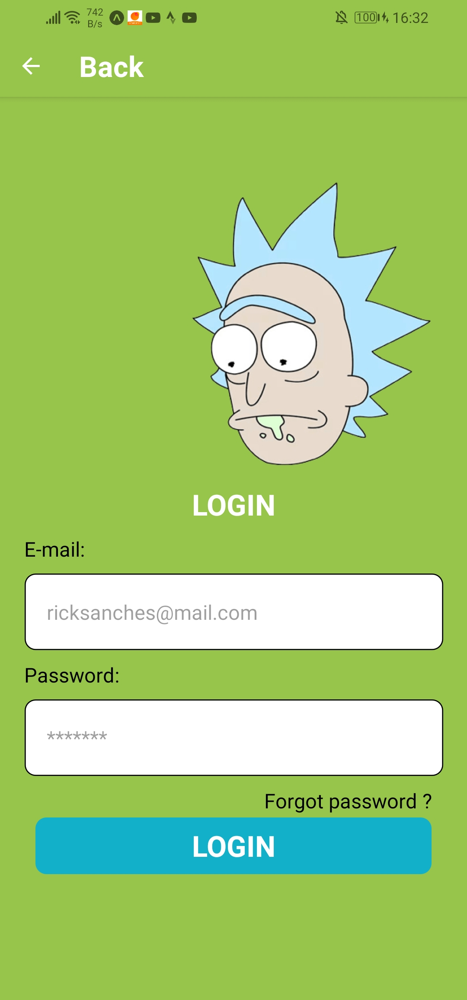
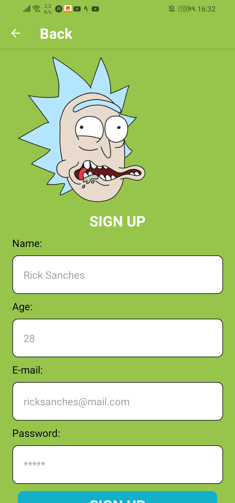
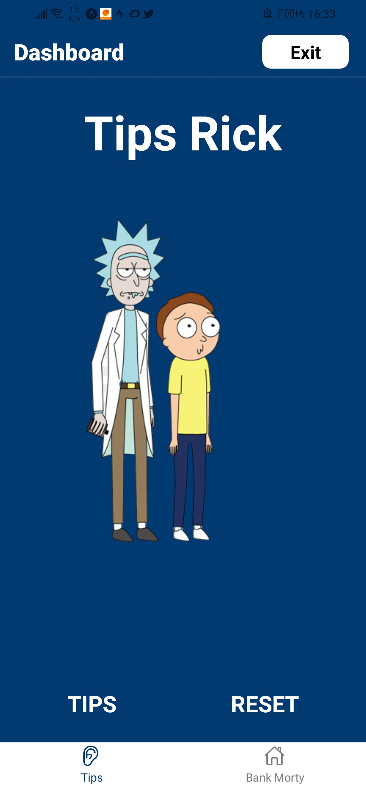
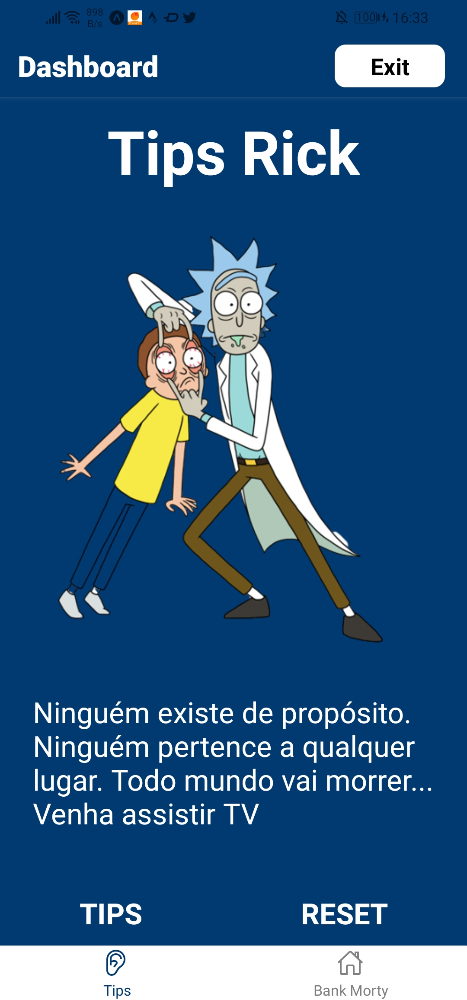
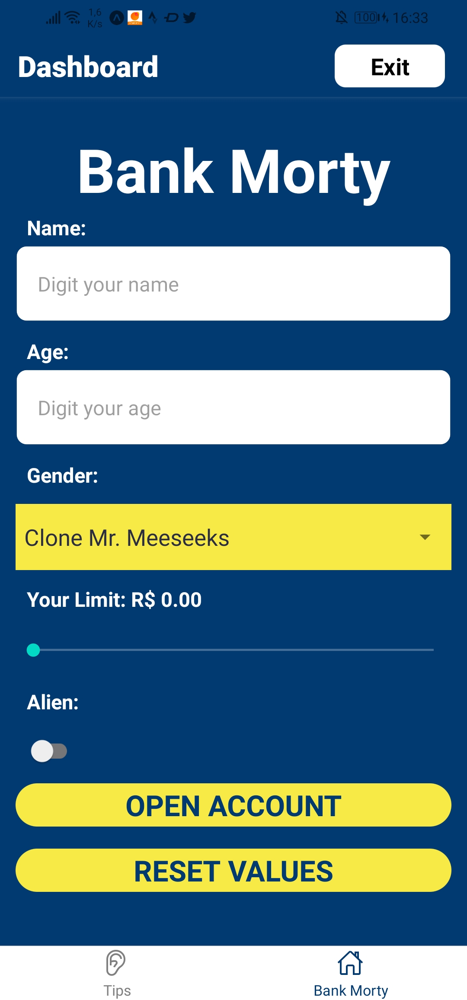

# Trabalho Final Mobile

🎓 College: [Faculdade Metodista Granbery](http://granbery.edu.br/)

👨‍🏫 Teacher: [Érica Carvalho - Github](https://github.com/ericacrcarvalho) | [Linkedin](https://www.linkedin.com/in/ericacrcarvalho/)

---

### Subject: Introduction to Mobile Development
### Delivery date: 06/05/22 (via AVA) - Presentation date: 06/06/22
#### Value: 4 points
#### Theme: Teacher’s suggestion or topic chosen by the group

---

## Theme suggestion

Create an application that contains a login and registration screen by inserting animations.

At least 4 screens must be created, one screen must be the Assessment 1 app and another screen the Assessment 2 app.

#### The home screen must contain the following items:
- Company logo/theme
- Two fields for filling in the username and password
- One button to log in/access
- One button to register new user

### Note:
- Every application must be tested on a cell phone.
- When loading the home screen, there must be an animation in the View containing the username and password fields and the login and register buttons.
- When typing the user, when the keyboard opens, the logo should decrease, when the keyboard closes, the logo should return to its original size.

---

### The registration screen must contain the following items:
- A field to enter the new user
- A field to enter the password
### Note:
- There must be at least two animations on the registration screen.

After registering a new user, they must be redirected to the home screen. After logging in (without any type of verification), you must be redirected to a new screen that must contain Tabs navigation with at least two screens:

- Home: the content of this screen is at the discretion of the student
- Assessment 1 app (mandatory).
- Assessment 2 app (mandatory).
- Any other screen(s) (optional).
- Each of these screens must contain at least one animation (View, Text,
image, etc.)

---

### The following elements must be present in the code:
- The code must be organized and readable. Folders must be created for each “part” of the code: components, images, screens, routes, etc.
- Colors and sizes must be in a separate file (e.g. colors.js and sizes.js)
- Buttons and text inputs, etc. must be a stateless component (e.g. MyButton.js and MyTextInput.js)
______________________________________________________________________
### Important informations:
All content presented in class must be used in the work:
- React Native components
- React Hooks (useState, useEffect, useContext)
- Navigation
- Animation
- Any extra content will be validated.
______________________________________________________________________
Comments:
- Work must be done in groups and copying someone else’s work is not allowed
group. If this occurs, the grade will be divided by the total number of students involved in the copy.
- The Github link containing the work (or zipped file) must be sent
by AVA until 11pm on 06/05/22.
- All students must present their work on the agreed date.
- If you have any questions/problems, please contact us via email.
### Screens

### Referências

[freepnglogos](https://www.freepnglogos.com/images/rick-and-morty-31013.html)

[freepnglogos](https://www.freepnglogos.com/images/rick-and-morty-30969.html)

[freepnglogos](https://www.freepnglogos.com/pics/rick-and-morty)

[pensador](https://www.pensador.com/autor/rick_and_morty/)

[subpng](https://www.subpng.com/png-667jk2/)

[kissclipart](https://www.kissclipart.com/rick-sanchez-rick-and-morty-clipart-rick-sanchez-m-u2wtry/)

[subpng](https://www.subpng.com/png-pat8a4/)

[subpng](https://www.subpng.com/png-goara7/)
